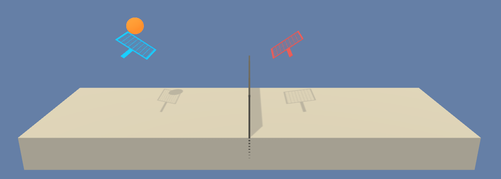
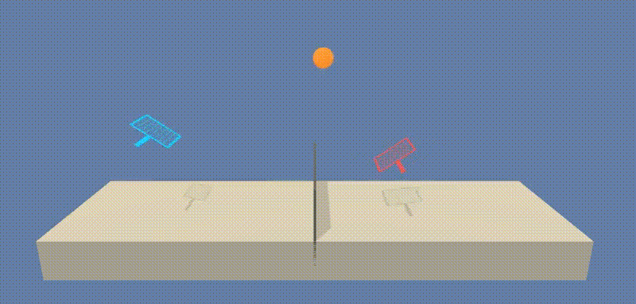

# Deep Tennis

Requirements: https://review.udacity.com/#!/rubrics/1891/view

This is a Python implementation of a policy gradient based reinforcement learning agent 
learning to solve the "Tennis" environment from Unity's ML-agents collection.
This project was done as part of the Udacity Deep Reinforcement Learning Nanodegree. 



# Description of the environment

In this environment, two agents control rackets to bounce a ball over a net. If an agent hits the ball over the net, it receives a reward of +0.1. If an agent lets a ball hit the ground or hits the ball out of bounds, it receives a reward of -0.01. Thus, the goal of each agent is to keep the ball in play.

The observation space consists of 8 variables corresponding to the position and velocity of the ball and racket. Each agent receives its own, local observation. Two continuous actions are available, corresponding to movement toward (or away from) the net, and jumping.

The task is episodic, and in order to solve the environment, your agents must get an average score of +0.5 (over 100 consecutive episodes, after taking the maximum over both agents). Specifically,

After each episode, we add up the rewards that each agent received (without discounting), to get a score for each agent. This yields 2 (potentially different) scores. We then take the maximum of these 2 scores.
This yields a single score for each episode.

The environment is considered solved, when the average (over 100 episodes) of those scores is at least +0.5.

# Installation instructions

The scripts in this repository require Python 3.6 and the following packages to run properly: 

* pytorch
* numpy
* matplotlib
* requests

The installation instructions are as follows (tested on a Linux system): 

0. Clone this repository using
```commandline
git clone https://github.com/jwergieluk/deep_tennis.git
```
1. Install Anaconda Python distribution: https://www.anaconda.com/distribution/#download-section
2. Create a virtual environment with all the necessary packages and activate it:
```commandline
conda create -n deep_tennis -c python=3.6 pytorch torchvision numpy pandas matplotlib requests click
conda activate deep_tennis
```
3. Clone Udacity's `deep-reinforcement-learning` repository and install the necessary Python package
into the environment:
```commandline
git clone --depth 1 https://github.com/udacity/deep-reinforcement-learning.git
cd deep-reinforcement-learning/python 
pip install .
cd ../..
```
4. Download the environment files using the provided script:
```commandline
cd deep_tennis
python download_external_dependencies.py
cd ..
```
5. Clone and install the `ml-agents` package provided by Unity: 
```commandline
git clone --depth 1 https://github.com/Unity-Technologies/ml-agents.git
cd ml-agents/ml-agents
pip install .
cd ../../deep_tennis
```

All development and testing of this code was performed on an Arch Linux system in April and Mai 2019. 

# Usage

## Watch a trained agent

Use the following command to load a pretrained agent parameters  and watch the agent's interactions with the environment: 
```commandline
python deep_tennis.py test --actor-weights-file checkpoint-actor.pth --critic-weights-file checkpoint_critic.pth
```



## Train an agent

The `train` command of the `deep_tennis.py` script can be used to train an agent 
and save the learned parameters to disk: 
```commandline
python deep_tennis.py train --max-episodes 250
```

The above command runs for 250 training episodes and saves the resulting parameters of a trained agent to the current directory.

# License

deep_tennis is released under the MIT License. See LICENSE file for details.

Copyright (c) 2019 Julian Wergieluk

